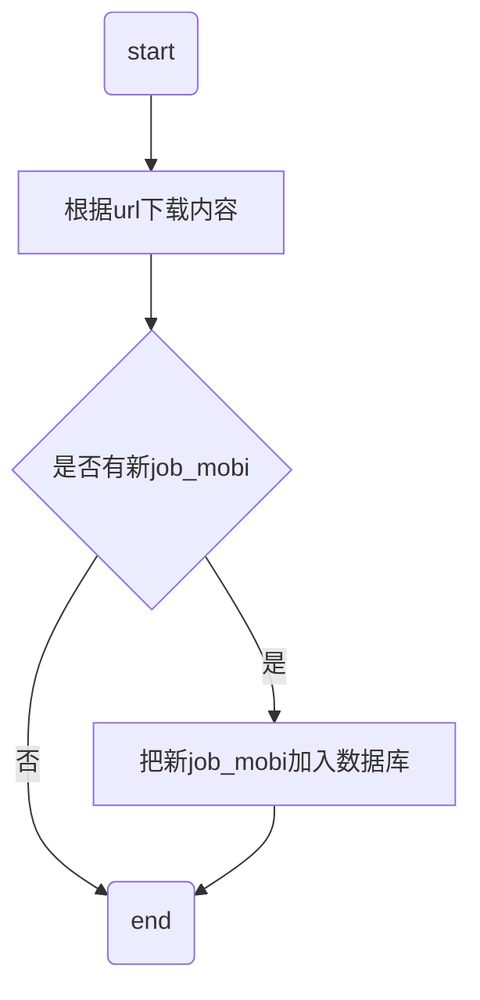

### add_mobi_job 流程图

```mermaid
graph TD;
  start(start)-->download_start_url[根据url下载内容];
  download_start_url-->check_new_mobi{是否有新job_mobi};
  check_new_mobi--是-->add_mobi_job[把新job_mobi加入数据库];
  check_new_mobi--否-->end_id(end);
  add_mobi_job-->end_id;
```

### download_job 流程图
